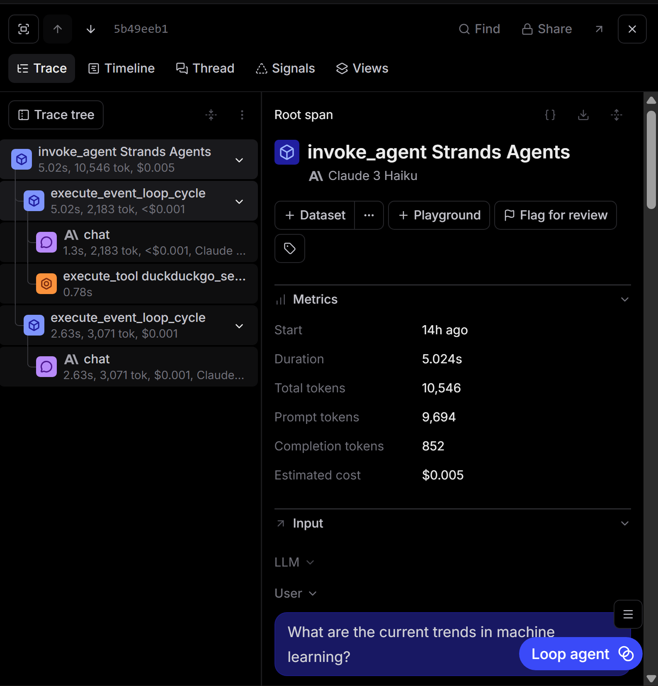

The biggest topic of interest can be seen in the image above, which shows the lifecycle of the AI agent -- first, an overarching 'invoke_agent' cycle encapsulates the entire process, including two event loop cycles. It appears that the first event loop cycle calls an LLM to process the query and call the proper tooling, while the second event loop cycle calls an LLM with the context and tool output to produce the output to the original query.

Additionally, we can see the metrics associated with each individual part of the cycle (initial LLM call, tool call, second LLM call), such as how much they cost, how long they take, and how long it took for the process to begin relative to the start of the entire cycle. This is useful to help figure out bottlenecks, high cost tools/steps, and what is taking the most time.